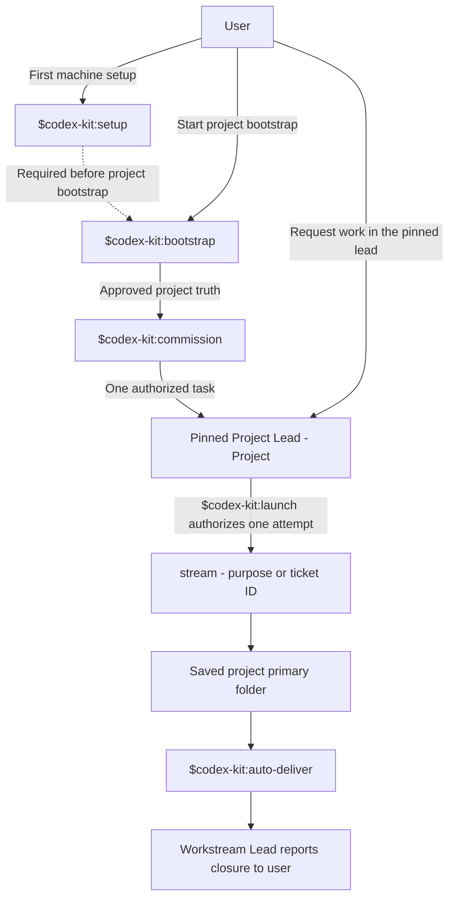

# Codex Kit

Codex Kit is a Codex operating framework for software projects. It provides
plugin-distributed machine setup, project bootstrap, Project Lead commission,
Workstream launch, spawned execution, fresh assurance, portfolio review, and
learning routing.

A consuming project owns its source truth, architecture, commands, domain
rules, technical decisions, and release controls. The human owns temporary
coordination that must cross task boundaries.

## Operating model

`plugins/codex-kit/references/operating-model.md` is the canonical routing
policy.

Each long-running project has one pinned Project Lead with the exact title
`Project Lead - <Project>`. Only the first character of the project profile
value is uppercase in the title. The `bootstrap` skill creates or migrates
durable project guidance. The `commission` skill creates and pins the lead from
that truth. The lead performs basic intake and launches one Workstream after an
explicit `launch` invocation. The Workstream Lead owns detailed planning,
orchestration, assurance, gates, and direct user closure. It is read-only. A
spawned execution agent performs every authorized mutation. See the canonical
policy for model, task, branch, and ownership boundaries.

## Skill map

Machine setup and project bootstrap establish the environment and durable
project truth. Commission creates the pinned Project Lead. After commission,
the human starts each Workstream from that task.



The Project Lead remains available for new intake and launch requests. It does
not track a Workstream after launch. A Workstream is a user-visible Codex task,
not a native subagent. Its Workstream Lead owns this delivery loop:

```mermaid
flowchart LR
    I["Detailed intake"] --> P["Decision-complete plan"]
    P --> E["Spawned execution agent"]
    E --> R["Fresh independent review"]
    R -->|Accepted findings| M["Spawned remediation agent"]
    M --> RR["Fresh independent review after remediation"]
    RR --> V["Fresh independent verification"]
    R -->|No finding| V
    V --> A["Acceptance assessment"]
    A --> L["Route learnings when needed"]
    L --> C["Close directly with user"]
```



The plugin manifest shows four primary human entry skills:

- `$codex-kit:setup` requires an installed Codex Kit plugin. It manages
  Kit-owned machine files for first use, upgrade, repair, check, or uninstall.
- `$codex-kit:bootstrap` requires completed machine setup and a target project.
  It inspects project evidence, runs intake, and applies approved project
  guidance. It does not create a Project Lead.
- `$codex-kit:commission` requires approved project truth and no pinned Project
  Lead. It creates and pins exactly one Project Lead.
- `$codex-kit:launch` requires the verified pinned Project Lead for the same
  saved project. It makes one attempt to start one user-visible Workstream task.

The human-entry skill `$codex-kit:portfolio` is available through explicit
invocation and the skill UI.

The agent-only procedures `$codex-kit:auto-deliver` and
`$codex-kit:auto-route-learnings` are invoked from Workstream Lead packets or
when accepted information needs routing. They are not human entry skills.

The manifest starter prompts are not a complete skill catalog. Each skill's
name and full `SKILL.md` description support discovery. Its `openai.yaml`
supplies concise skill-list text and an example prompt.

## New machine setup

`<codex-kit-repository-url>` is the authorized Git URL for the Kit. Use an
authorized HTTPS or SSH Git form. Access to a private repository uses the
operator's configured Git credentials. Do not assume a Git host, account,
organization, or branch.

The Git repository root contains `.agents/plugins/marketplace.json`. Register
the Git marketplace once. Then install the plugin from that marketplace:

```bash
codex plugin marketplace add <codex-kit-repository-url>
codex plugin add codex-kit@codex-kit
```

Start a new Codex task. Enter:

```text
Use $codex-kit:setup.
Preview the managed machine changes.
Apply them only after I approve the preview.
Validate the completed installation.
```

The setup skill runs the deterministic installer that is inside the installed
plugin. It adds a short managed block to global `AGENTS.md`. It also installs
two native-agent profiles: a Luna worker and a Terra worker. Required read-only
delegated lanes run through the skill-local ephemeral Codex CLI helper instead
of a native-agent profile. Setup records the native profile hashes and the Kit
version.

Plugin installation does not run machine setup. The plugin system does not
provide an arbitrary post-install script interface. The operator does not need
a permanent Kit checkout, the plugin cache path, or a manual Python command.

After setup succeeds, start another new task. That task loads the installed
global guidance and native-agent profiles.

## Project bootstrap

Start a Sol chat with High reasoning inside the target local project. Enter
only:

```text
Use $codex-kit:bootstrap.
```

Project bootstrap uses one workflow for all projects. Existing source and existing
agent files change the evidence that informs intake. They do not replace
intake. The normal cases are:

1. Greenfield: little or no source and no detected agent footprint.
2. Brownfield A: existing source and no detected agent footprint.
3. Brownfield B: a detected foreign, legacy, or current Codex Kit footprint.

An empty project with agent files is greenfield for source and Brownfield B for
the agent footprint. Bootstrap records these facts separately as
`source_state` and `prior_agent_footprint`.

The read-only helper requires an existing project directory. It lists visible
root files and immediate directories. It also reports likely root and CI
configuration, conventional agent files, and conventional documentary truth.
It does not recursively inspect source files or parse languages. It does not
read secret file classes.

When the project has `.gitignore`, the helper applies Git ignore rules. It uses
temporary Git metadata when the folder is not a worktree. If Git cannot apply
an existing ignore file, automated discovery stops and intake supplies the
missing facts. `.gitignore` is useful but is not required.

Every case receives the same purpose, architecture, constraints, risks,
verification, and delivery intake. Root configuration evidence makes the
questions more specific. Intake confirms the final source and footprint
values, languages, frameworks, platforms, infrastructure, design systems,
commands, and review needs.

For Brownfield B, bootstrap proposes one disposition for each prior item: lift
unchanged, transform, recreate, or remove. It preserves source, assets, unique
project workflows, and evidence-backed facts. It replaces recognized prior
orchestration and local copies of installed shared skills by default. Shared
skills are referenced from installed plugins and are not copied into the
repository.

Bootstrap presents every creation, edit, move, and deletion in one exact
project-change diff. It applies nothing before approval. Current Codex Kit
projects can run bootstrap again through this process. The final control
profile uses schema version 2 and has no singular technology profile.

After the approved repository change passes its structural and semantic checks,
bootstrap reports the durable truth paths and stops. Invoke
`$codex-kit:commission` in a new task when no pinned Project Lead exists.

The helper does not support symlinked project paths.

## Plugin and machine upgrade

Refresh the Git marketplace snapshot. Then install or refresh the plugin from
that snapshot:

```bash
codex plugin marketplace upgrade codex-kit
codex plugin add codex-kit@codex-kit
```

Start a new setup task. Enter:

```text
Use $codex-kit:setup.
Preview the managed machine upgrade.
Apply it only after I approve the preview.
Validate the completed upgrade.
```

The setup skill updates only Kit-managed machine files. Existing tasks do not
reload changed plugin skills, global guidance, or custom-agent profiles. Start
a new setup task after each plugin upgrade and a new operational task after
setup succeeds. Setup does not support symlinked `CODEX_HOME` or managed paths.

### Routine upgrade

Use this process when a release changes documentation, an isolated tool, or
behavior that the current Project Lead does not need:

1. Pause affected work.
2. Upgrade the marketplace and plugin.
3. Run `$codex-kit:setup` in a new task.
4. Validate in a fresh task.
5. Continue the existing Project Lead only when its operating rules did not
   change.

### Project guidance and Project Lead cutover

Use this process when a release changes project guidance, Project Lead
instructions, model or reasoning policy, launch behavior, review or
verification boundaries, approval boundaries, learning routing, or other
behavior that active tasks cannot reload:

1. Upgrade the marketplace and plugin.
2. Run `$codex-kit:setup` in a fresh task.
3. Run `$codex-kit:bootstrap` in the target project. Review and approve its
   exact project-guidance diff.
4. Put accepted durable facts in project documentation.
5. Prepare an optional transient packet when the new lead needs temporary
   context.
6. Confirm that active Workstreams can continue without Project Lead control.
7. Archive the prior Project Lead.
8. Invoke `$codex-kit:commission` in a fresh task. The invocation authorizes one
   new pinned lead.
9. Verify that the new lead acknowledges its project truth and waits for
   `$codex-kit:launch`.

For a lead-only replacement, prepare any optional packet, archive the old lead,
and invoke `$codex-kit:commission`. Do not run bootstrap when project guidance
does not need a change.

## Uninstall

Remove Kit-owned machine files before you remove the plugin. Start a task that
can still use the setup skill. Enter:

```text
Use $codex-kit:setup.
Preview removal of Codex Kit managed machine files.
Remove them only after I approve the preview.
```

After the approved removal succeeds, run:

```bash
codex plugin remove codex-kit
codex plugin marketplace remove codex-kit
```

The setup skill refuses to remove a modified native-agent profile. Project
instructions and project truth remain in each project repository.

## Operational limits

- Plugin installation and machine setup are separate operations.
- Setup is explicit. It is not an automatic post-install action.
- Setup can need approval to write global Codex files.
- The first setup needs one task that can discover the plugin.
- A later new task must load installed global guidance and profiles.
- Upgrade is not atomic across the plugin and managed machine files.
- Uninstall must remove machine files before it removes the setup skill.
- Existing tasks do not automatically adopt new Kit behavior.

## Other operator workflows

Use `$codex-kit:portfolio` for a read-only comparison of Project Lead identity
and readiness or selected project roots. Workstream Lead packets use
`$codex-kit:auto-route-learnings` for accepted information routing.

Codex Kit does not archive a prior Project Lead. The human prepares any needed
transient packet and archives the old task before commission.

## Maintainer development

This section is for source development. Normal operators do not use it.

Clone the source repository into a maintainer-selected path:

```bash
git clone <codex-kit-repository-url> /path/to/codex-kit
```

The top-level installer and project commands are small wrappers around the
canonical plugin-bundled implementations. Run repository validation from the
checkout:

```bash
cd /path/to/codex-kit
python3 tools/doctor.py --kit-root .
python3 -m unittest discover -s tests
python3 tools/install.py --dry-run
python3 tools/project.py --project-root .
git diff --check
```

Use a temporary `CODEX_HOME` for installer tests. Do not install the development
plugin or register its marketplace as part of repository validation.

The `0.6.0` release uses semantic version precedence for UI updates. Use the
plugin cachebuster helper after plugin edits. Do not edit marketplace metadata
by hand.

### Lead-only follow-up

When project guidance already matches this release, do not run bootstrap.
Upgrade the plugin, validate setup in a fresh task, prepare any optional
transient packet, and have the human archive the prior Project Lead. Commission
a new lead in a fresh task. Confirm that it acknowledges its project and ends
the turn without Workstream intake or a purpose question.

## Model release test

After a Codex or model release, use `tests/release-evaluation.md`. Record the
model, reasoning, time, changed scope, checks, and review findings for each
scenario. Change a routing pin only in a reviewed Codex Kit release.

## Tool creation rule

Use an existing project command or maintained tool before you propose a new
reusable tool. Get explicit human approval before you create a reusable script,
tool, hook, MCP server, or separate tool repository. Record the duplicate
search, expected reuse, owner, maintenance cost, security boundary, and
validation plan in the proposal.
